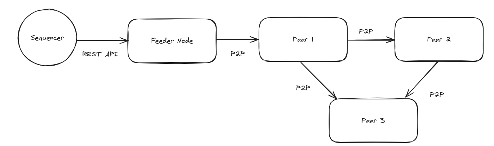

# Juno P2P Workshop

This workshop is based on the tutorial in the [announcement blog post](https://medium.com/nethermind-eth/junos-experimental-peer-to-peer-launch-3040e195550d).

`run.sh`: sync three Juno nodes using p2p on the Sepolia testnet. The first node is the "feeder node" that syncs directly from the centralized sequencer, the second node syncs from the feeder node over p2p, and the third syncs from the second over p2p.



`reset.sh`: stop, tear down the nodes, and clean up.

## Manual Steps

```bash
docker network create juno
```

### Start Feeder Node

```bash
docker run --rm -it nethermind/juno:v0.10.0 genp2pkeypair
```

Create environment variables based on the above output:

```bash
FEEDER_P2P_PRIVATE_KEY=...
FEEDER_P2P_PEERID=...
```

```bash
docker run -d --name juno_feeder \
    --network juno \
    -p 6060:6060 \
    -p 7777:7777 \
    -v ./juno_sepolia_feeder:/var/lib/juno_feeder \
    nethermind/juno:v0.10.0 \
    --db-path "/var/lib/juno_feeder" \
    --network "sepolia" \
    --log-level "debug" \
    --http \
    --http-host "0.0.0.0" \
    --http-port "6060" \
    --p2p \
    --p2p-feeder-node \
    --p2p-private-key=$FEEDER_P2P_PRIVATE_KEY \
    --p2p-addr="/ip4/0.0.0.0/tcp/7777"
```

### Start First Peer

```bash
docker run --rm -it nethermind/juno:v0.10.0 genp2pkeypair
```

Create environment variables based on the above output:

```bash
PEER1_P2P_PRIVATE_KEY=...
PEER1_P2P_PEERID=...
```

```bash
docker run -d --name juno_peer1 \
    --network juno \
    -p 6061:6061 \
    -p 7778:7778 \
    -v ./juno_sepolia_peer1:/var/lib/juno_peer1 \
    nethermind/juno:v0.10.0 \
    --db-path "/var/lib/juno_peer1" \
    --network "sepolia" \
    --log-level "debug" \
    --http \
    --http-host "0.0.0.0" \
    --http-port "6061" \
    --p2p \
    --p2p-addr=/ip4/0.0.0.0/tcp/7778 \
    --p2p-peers=/dns4/juno_feeder/tcp/7777/p2p/$FEEDER_P2P_PEERID \
    --p2p-private-key=$PEER1_P2P_PRIVATE_KEY
```

### Start Second Peer

```bash
docker run -d --name juno_peer2 \
    --network juno \
    -p 6062:6062 \
    -p 7779:7779 \
    -v ./juno_sepolia_peer2:/var/lib/juno_peer2 \
    nethermind/juno:v0.10.0 \
    --db-path "/var/lib/juno_peer2" \
    --network "sepolia" \
    --log-level "debug" \
    --http \
    --http-host "0.0.0.0" \
    --http-port "6062" \
    --p2p \
    --p2p-addr=/ip4/0.0.0.0/tcp/7779 \
    --p2p-peers="/dns4/juno_feeder/tcp/7777/p2p/$FEEDER_P2P_PEERID,/dns4/juno_peer1/tcp/7778/p2p/$PEER1_P2P_PEERID"
```
