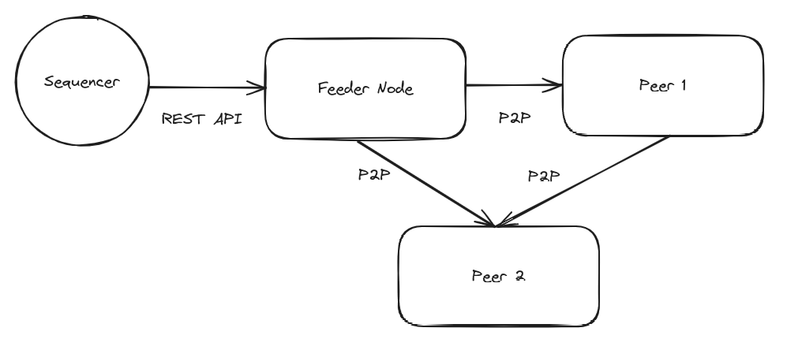

# Juno P2P Workshop

`run.sh`: sync three Juno nodes using p2p on the Sepolia testnet. The first node is the "feeder node" that syncs directly from the centralized sequencer, the second node syncs from the feeder node over p2p, and the third syncs from the second over p2p.

`reset.sh`: stop, tear down the nodes, and clean up.
